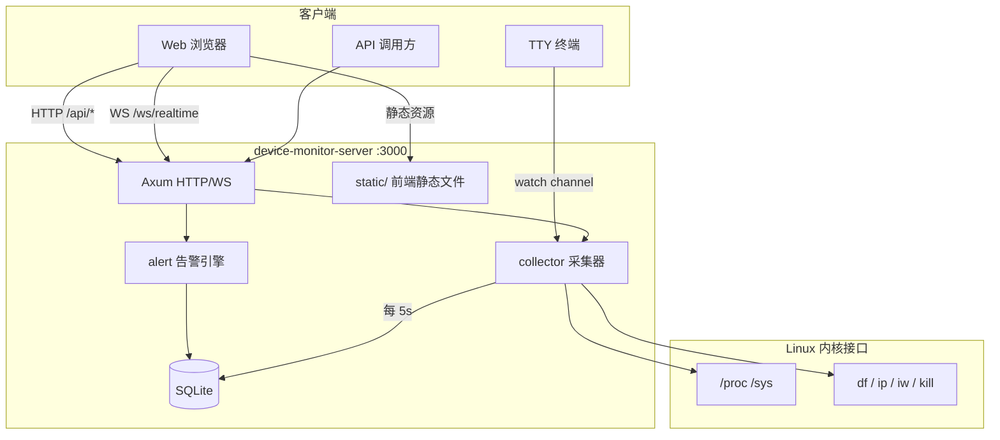

# Device Monitor

面向嵌入式 Linux 设备（Android 手机、开发板等）的**系统监控与硬件控制**平台。通过 Web 仪表盘、REST API、WebSocket 实时推送和可选 TUI 终端界面，集中展示 CPU、内存、磁盘、网络、温度、电池等指标，并支持手电筒、屏幕亮度、振动马达等硬件操作。

> 仓库地址：[github.com/xgd16/device-monitor](https://github.com/xgd16/device-monitor)

---

## 功能概览

### 系统监控

| 模块 | 说明 |
|------|------|
| **CPU** | 总体与各核心使用率、频率、负载均值 |
| **内存** | 物理内存 / Swap 用量与使用率 |
| **磁盘** | 分区容量、inode、I/O 统计、设备类型 |
| **温度** | 遍历 `/sys/class/thermal` 全部传感器 |
| **电池** | 电量、充放电状态、电压/电流/温度、预估剩余时间 |
| **网络** | 网卡状态、IP、累计流量；WiFi / 蓝牙详情 |
| **进程** | 进程列表、详情查看、发送信号终止进程 |
| **日志** | 读取系统日志并支持关键字/级别过滤 |
| **告警** | CPU 高温、内存过高、低电量自动告警并持久化 |
| **终端** | Web 终端（PTY shell），支持多 Tab、resize、粘贴 |
| **文件管理** | 浏览/上传/下载/编辑/重命名/移动/复制/删除 |

### 硬件控制

| 功能 | 实现方式 |
|------|----------|
| 手电筒（白/黄 LED） | sysfs `/sys/class/leds/*:flash/brightness` |
| 屏幕亮度 | sysfs 背光节点 |
| 屏幕开关 | sysfs `bl_power` |
| 振动 | 外部 `vibrate` 命令 / input 子系统 |
| 释放内存 | `sync` + `/proc/sys/vm/drop_caches`（需 root） |

### 其他

- **WebSocket 实时推送**：每 5 秒推送完整 `SystemOverview` JSON
- **SQLite 历史存储**：指标快照与告警记录，自动清理 7 天前数据
- **TUI 模式**：在物理 TTY（如 `/dev/tty1`）上渲染 ASCII 仪表盘
- **Web 前端**：React + HeroUI，暗色/亮色主题，ECharts 趋势图

---

## 架构



**数据流：**

1. 后台任务每 **5 秒**调用 `collect_system_overview()` 采集系统指标
2. 结果通过 `watch` channel 广播给 WebSocket 客户端和 TUI
3. 同时写入 SQLite，并触发告警引擎检查
4. 前端通过 WebSocket 接收实时数据，部分数据（进程、WiFi、告警）每 10 秒 REST 轮询

---

## 技术栈

| 层级 | 技术 |
|------|------|
| 后端 | Rust 2024、Axum 0.8、Tokio、Rusqlite、Tracing |
| 前端 | React 19、TypeScript、Vite 8、HeroUI、Zustand、ECharts |
| 部署 | PM2（可选）、Shell 脚本 |

---

## 项目结构

```
device-monitor/
├── src/                        # Rust 后端源码
│   ├── main.rs                 # 入口：路由、后台采集、TUI 启动
│   ├── api/                    # REST API 处理器
│   ├── collector/              # 系统指标采集（/proc、/sys）
│   ├── store/                  # SQLite 持久化
│   ├── alert/                  # 告警引擎
│   ├── ws/                     # WebSocket 推送
│   └── tui/                    # 终端 UI
├── device-monitor-web/         # React 前端源码
│   └── src/
│       ├── components/         # 仪表盘卡片组件
│       ├── hooks/              # WebSocket Hook
│       ├── stores/             # Zustand 状态
│       └── api/                # Axios API 封装
├── static/                     # 前端构建产物（由 Vite 输出）
├── Cargo.toml
├── start.sh                    # 一键构建并启动
├── ecosystem.config.js         # PM2 配置
├── setup-permissions.sh        # 硬件 sysfs 权限修复
└── test_vibrate.rs             # 振动马达 ioctl 测试工具
```

---

## 环境要求

### 后端

- **Rust** 1.85+（edition 2024）
- **Linux** 内核，具备 `/proc`、`/sys` 文件系统
- 可选：`ip`、`iw`、`df`、`kill`、`dmesg` 等系统命令

### 前端（开发/构建）

- **Node.js** 18+
- **npm** 9+

### 平台说明

部分硬件路径针对**高通 Android/Linux 平台**定制，例如：

- 电池：`/sys/class/power_supply/qcom-battery/`
- 背光：`/sys/class/backlight/ae94000.dsi.0/`
- 手电筒：`/sys/class/leds/white:flash`、`yellow:flash`

移植到其他设备时需修改 `src/collector/battery.rs`、`src/collector/hardware.rs` 中的 sysfs 路径。

---

## 快速开始

### 1. 克隆仓库

```bash
git clone git@github.com:xgd16/device-monitor.git
cd device-monitor
```

### 2. 构建并启动（生产模式）

```bash
# 构建前端 → 构建后端 → 启动服务
./start.sh
```

或分步执行：

```bash
# 前端构建（输出到 static/）
cd device-monitor-web
npm install
npm run build
cd ..

# 后端构建
cargo build --release

# 启动（监听 0.0.0.0:3000）
./target/release/device-monitor-server
```

浏览器访问：**http://\<设备IP\>:3000**

### 3. 开发模式

**终端 1 — 后端：**

```bash
cargo run
# 默认监听 http://0.0.0.0:3000
```

**终端 2 — 前端热更新：**

```bash
cd device-monitor-web
npm install
npm run dev
# Vite 开发服务器 http://0.0.0.0:3000
```

> **注意：** `vite.config.ts` 中 API 代理目标为 `localhost:3001`，与后端默认端口 `3000` 不一致。开发时请将代理改为 `http://localhost:3000`，或调整后端端口以匹配。

---

## TUI 终端模式

在无图形界面或本地屏幕上显示实时监控：

```bash
# 默认写入 /dev/tty1
./target/release/device-monitor-server --tui

# 指定 TTY 设备
./target/release/device-monitor-server --tui --tty /dev/tty2
```

TUI 与 Web 服务可同时运行，共享同一 `watch` 数据通道。

---

## 硬件权限配置

硬件控制需要 sysfs 节点写权限。以 root 执行：

```bash
sudo ./setup-permissions.sh
```

脚本内容：

- `chmod 666` 手电筒 LED brightness 节点
- `chmod 666` 背光 brightness / bl_power 节点

释放内存（`clear-memory`） additionally 需要 **root** 权限写入 `/proc/sys/vm/drop_caches`。

振动功能依赖系统中的 `vibrate` 命令，或使用 `test_vibrate` 工具直接通过 ioctl 驱动：

```bash
rustc test_vibrate.rs -o test_vibrate
sudo ./test_vibrate 500   # 振动 500ms
```

---

## PM2 部署

```bash
# 安装 PM2
npm install

# 修改 ecosystem.config.js 中的 cwd 为实际部署路径
# 构建 release 二进制
cargo build --release

# 启动
npx pm2 start ecosystem.config.js
npx pm2 save
```

---

## API 文档

所有 REST 接口前缀为 `/api`，统一响应格式：

```json
// 成功
{ "code": 0, "data": { ... } }

// 失败
{ "code": -1, "error": "错误信息" }
```

### 系统指标

| 方法 | 路径 | 说明 |
|------|------|------|
| GET | `/api/system/overview` | 完整系统概览（实时采集） |
| GET | `/api/cpu` | CPU 使用率与频率 |
| GET | `/api/memory` | 内存与 Swap |
| GET | `/api/disk` | 磁盘分区与 I/O |
| GET | `/api/thermal` | 温度传感器列表 |
| GET | `/api/battery` | 电池状态 |
| GET | `/api/network` | 网络接口列表 |
| GET | `/api/network/wifi` | WiFi 连接信息 |
| GET | `/api/network/bluetooth` | 蓝牙适配器信息 |

### 进程管理

| 方法 | 路径 | 说明 |
|------|------|------|
| GET | `/api/process` | 进程列表（按内存降序） |
| GET | `/api/process/{pid}` | 进程详情 |
| POST | `/api/process/{pid}/kill` | 发送信号，`body: { "signal": "TERM" }` |

支持的 signal：`TERM`、`KILL`、`STOP`、`CONT`、`HUP`、`USR1`、`USR2`

### 日志

| 方法 | 路径 | 说明 |
|------|------|------|
| GET | `/api/logs` | 查询参数：`lines`、`keyword`、`level` |

日志来源优先级：`/var/log/messages` → `/var/log/syslog` → `dmesg`

### 告警

| 方法 | 路径 | 说明 |
|------|------|------|
| GET | `/api/alerts` | 最近 50 条告警 |
| GET | `/api/alerts/config` | 告警阈值配置 |
| PUT | `/api/alerts/config` | 更新阈值（尚未持久化） |

默认阈值：

| 项目 | 默认值 |
|------|--------|
| CPU 温度 | 70°C |
| 内存使用率 | 90% |
| 电池低电量 | 15%（非充电状态） |

同类告警冷却时间：**300 秒**

### 硬件控制

| 方法 | 路径 | 请求体 | 说明 |
|------|------|--------|------|
| GET | `/api/hardware` | — | 当前硬件状态 |
| POST | `/api/hardware/flashlight` | `{ "led": "white", "on": true }` | 手电筒 |
| POST | `/api/hardware/brightness` | `{ "percent": 80 }` | 屏幕亮度 0–100 |
| POST | `/api/hardware/screen` | `{ "on": true }` | 屏幕背光开关 |
| POST | `/api/hardware/vibrate` | `{ "duration_ms": 500 }` | 振动一次 |
| POST | `/api/hardware/vibrate/pattern` | `{ "segments": [...], "repeat": false }` | 振动模式 |
| POST | `/api/hardware/vibrate/stop` | — | 停止振动 |
| POST | `/api/hardware/clear-memory` | — | 释放页缓存 |

### 数据库管理

| 方法 | 路径 | 说明 |
|------|------|------|
| GET | `/api/database/stats` | 记录数与时间范围 |
| POST | `/api/database/cleanup` | 手动清理 7 天前数据 |

### 文件管理

| 方法 | 路径 | 说明 |
|------|------|------|
| GET | `/api/files/list?path=` | 列目录（默认 `/`） |
| GET | `/api/files/stat?path=` | 文件/目录元信息 |
| GET | `/api/files/read?path=&offset=&limit=` | 读取文件（默认 256KB，最大 1MB） |
| PUT | `/api/files/write` | 写文本文件，`body: { "path", "content", "create"? }` |
| POST | `/api/files/upload` | multipart 上传，`path` + `file` 字段 |
| GET | `/api/files/download?path=` | 下载文件（二进制流） |
| POST | `/api/files/mkdir` | 创建目录，`body: { "path" }` |
| POST | `/api/files/rename` | 重命名，`body: { "from", "to" }` |
| POST | `/api/files/move` | 移动，`body: { "from", "to" }` |
| POST | `/api/files/copy` | 复制文件，`body: { "from", "to" }` |
| DELETE | `/api/files/delete?path=&recursive=` | 删除文件或目录 |
| POST | `/api/files/compress` | 压缩，`body: { "paths": [...], "output": "/path/a.zip", "format": "zip\|7z\|rar" }` |
| POST | `/api/files/extract` | 解压，`body: { "path": "/path/a.zip", "dest": "/path/out", "overwrite"? }` |

压缩格式说明：

| 格式 | 压缩 | 解压 |
|------|------|------|
| zip | 纯 Rust（内置） | 纯 Rust（内置） |
| 7z | 纯 Rust（sevenz-rust） | 纯 Rust（内置） |
| rar | 需系统 `rar` 命令 | 需系统 `unrar` 或 `7z` 命令 |

路径经 `canonicalize` 规范化，防止 `../` 穿越；可访问完整文件系统。

---

## WebSocket

### 实时指标

**端点：** `ws://<host>:3000/ws/realtime`

连接后，每当后台完成一次采集（约 5 秒），服务端推送一条 JSON 文本消息，结构与 `SystemOverview` 一致：

```json
{
  "cpu": { "overall_usage": 12.5, "cores": [...] },
  "memory": { "total_mb": 7680, "used_mb": 4096, "usage_percent": 53.3, ... },
  "thermal": [...],
  "battery": { "capacity": 85, "status": "Discharging", ... },
  "network": [...],
  "uptime": 86400.0,
  "load_avg": [0.5, 0.3, 0.2],
  "process_count": 256,
  "timestamp": 1718366400
}
```

前端断线后每 **3 秒**自动重连。

### Web 终端

**端点：** `ws://<host>:3000/ws/terminal`

每个连接独立 PTY shell 会话（默认 `$SHELL` 或 `/bin/sh`）。单客户端最多 **3** 个并发会话。

**协议：**

| 方向 | 类型 | 说明 |
|------|------|------|
| 客户端 → 服务端 | Binary | 键盘/粘贴输入（原始字节） |
| 客户端 → 服务端 | Text JSON | `{"type":"resize","cols":80,"rows":24}` |
| 服务端 → 客户端 | Binary | PTY 输出 |
| 服务端 → 客户端 | Text JSON | `{"type":"exit","code":0}` shell 退出时 |

---

## 数据存储

- 数据库文件：`device_monitor.db`（运行目录下，已在 `.gitignore` 排除）
- **metrics 表**：每次采集的 JSON 快照
- **alerts 表**：告警记录（level、title、message）
- 自动清理：后台任务每小时删除 **7 天**前的 metrics 和 alerts，并执行 `VACUUM`

---

## 环境变量

| 变量 | 说明 | 默认值 |
|------|------|--------|
| `RUST_LOG` | Rust 日志级别 | `info` |

示例：

```bash
RUST_LOG=debug ./target/release/device-monitor-server
```

---

## 命令行参数

| 参数 | 说明 |
|------|------|
| `--tui` | 启用 TUI 终端仪表盘 |
| `--tty <path>` | TUI 目标 TTY 设备，默认 `/dev/tty1` |

---

## 常见问题

### 前端页面空白

确认已执行 `npm run build`，且 `static/index.html` 存在。后端通过 `ServeDir` 托管 `static/` 目录。

### 硬件控制返回权限错误

以 root 运行 `setup-permissions.sh`，或检查 sysfs 节点路径是否与你的设备匹配。

### WiFi 信息为空

确认存在 `wlan0` 接口且已安装 `iw` 工具。不同设备网卡名称可能不同，需修改 `src/collector/network.rs`。

### 开发模式 API 请求失败

检查 Vite 代理端口是否与后端监听端口一致（见「开发模式」说明）。

---

## 许可证

本项目源码仅供学习与个人使用。部署到生产环境前请评估安全影响（进程 kill、内存清理、硬件控制、**Web 终端**、**文件管理**等接口无鉴权，等同于 shell 级访问权限）。

---

## 相关链接

- [Axum Web 框架](https://github.com/tokio-rs/axum)
- [HeroUI React 组件库](https://heroui.com/)
