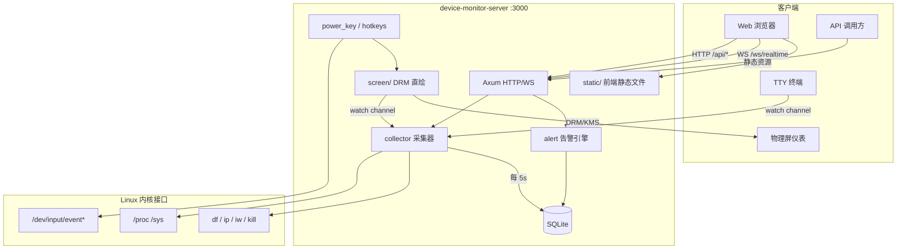

# Device Monitor

面向嵌入式 Linux 设备（Android 手机、开发板等）的**系统监控与硬件控制**平台。通过 **物理屏仪表**、Web 仪表盘、REST API、WebSocket 实时推送和字符 TUI 集中展示 CPU、内存、磁盘、网络、温度、电池、代理（mihomo）与 LLM 网关（XTokenHub）指标，并支持手电筒、屏幕亮度、充电电流/模式、GPU 频率上限、状态 LED、扬声器、振动马达等硬件操作。

> 仓库地址：[github.com/xgd16/device-monitor](https://github.com/xgd16/device-monitor)

---

## 功能概览

### 系统监控

| 模块 | 说明 |
|------|------|
| **CPU** | 总体与各核心使用率、频率、governor、负载均值；大核自动调度（见下） |
| **内存** | 物理内存 / Swap 用量与使用率 |
| **磁盘** | 分区容量、inode、I/O 统计、设备类型 |
| **温度** | 遍历 `/sys/class/thermal` 全部传感器 |
| **电池** | 电量、充放电状态、电压/电流/功率/温度、预估剩余时间；学习实际充电上限并给出健康度 |
| **网络** | 网卡状态、IP、累计流量；WiFi / 蓝牙详情 |
| **代理** | mihomo / Clash Meta 状态：控制器、版本、模式、TUN、当前节点与链路、连接数、累计流量、订阅更新时间 |
| **AI 网关** | XTokenHub 服务状态（`systemctl is-active xtokenhub`） |
| **进程** | 进程列表、详情查看、发送信号终止进程 |
| **日志** | 读取系统日志并支持关键字/级别过滤 |
| **告警** | CPU 高温、内存过高、低电量、XTokenHub 离线自动告警并持久化 |
| **终端** | Web 终端（PTY shell），支持多 Tab、resize、粘贴 |
| **文件管理** | 浏览/上传/下载/编辑/重命名/移动/复制/删除/压缩/解压 |

### CPU 大核自动调度

`collector/cpu_power.rs` 按「等效繁忙核心数」`demand_cores`（与在线核数无关的绝对负载）自动上下线大核，并按 5 秒采集节拍决策：

| 条件 | 动作 |
|------|------|
| `demand >= 3.2` 核 | 开满 4 个大核（4–7 号核） |
| `demand >= 2.4` 核 | 开 2 个大核 |
| `demand <= 2.0` 核 | 关闭全部大核 + 小核限频 |
| `2.0 ~ 2.4` 核 | 滞回带，维持现状 |
| 温度 `>= 75°C` | 只允许降档或维持，禁止升档 |

升档立即生效，降档需等保持期（6 × 5s = 30s）归零；所有 sysfs 写入后回读校验，写失败或内核静默丢弃时记 warn 并保持状态不变。

### 硬件控制

| 功能 | 实现方式 |
|------|----------|
| 手电筒（白/黄 LED） | sysfs `/sys/class/leds/*:flash/brightness` |
| 屏幕亮度 | sysfs 背光节点 |
| 屏幕开关 | sysfs `bl_power`，或面板 DPMS（物理屏仪表运行时） |
| 状态 LED | sysfs `/sys/class/leds/white:status/brightness`；可开关、设亮度、与 CPU 使用率联动 |
| 充电电流上限 | sysfs `current_max`（含有线/无线两档） |
| 充电模式 | 仅供电不充电 / 正常充电 |
| GPU 频率上限 | sysfs GPU 调频节点 |
| WiFi 省电 | `iw dev <iface> set power_save` |
| 扬声器 | 音量 / 静音 / 测试音（按可用后端选择 sink） |
| 振动 | 外部 `vibrate` 命令 / input 子系统 ioctl，支持多段模式 |
| 释放内存 | `sync` + `/proc/sys/vm/drop_caches`（需 root） |
| mihomo 订阅更新 | 执行 `MIHOMO_FETCH_SUB_SCRIPT`（默认 `/home/user/code/fetch_sub.py`） |

### 物理屏与按键

- **DRM/KMS 直绘横屏仪表**（首选）：`--screen`，横屏卡片布局，共 **2 页**（系统指标页 / XTokenHub Token 页）
- **kmscon UTF-8 字符 TUI**（回退）：`--tui`，支持中文（需 `kmscon` + `font-noto-cjk`）
- **裸 VT ASCII TUI**（兜底）：无 CJK 字形环境
- **按键**：电源键单击 = 屏幕熄灭/点亮（熄屏时暂停渲染与提交，采集与 WS 继续）、双击 = 切换白光/黄光手电筒；音量加/减键 = 上一页/下一页
- 启动链路、DRM 细节、排障见 **[SCREEN.md](SCREEN.md)**

### 其他

- **WebSocket 实时推送**：每 5 秒推送完整 `SystemOverview` JSON
- **SQLite 历史存储**：指标快照与告警记录，默认每 30 秒落库、自动清理 7 天前数据
- **Web 前端**：React + HeroUI，暗色/亮色主题，ECharts 趋势图

---

## 架构


```mermaid
flowchart TB
    subgraph client [客户端]
        Web[Web 浏览器]
        Screen[物理屏仪表]
        TUI[TTY 终端]
        API_Client[API 调用方]
    end

    subgraph server [device-monitor-server :3000]
        Axum[Axum HTTP/WS]
        Collector[collector 采集器]
        Alert[alert 告警引擎]
        Store[(SQLite)]
        Static[static/ 前端静态文件]
        Render[screen/ DRM 直绘]
        Input[power_key / hotkeys]
    end

    subgraph linux [Linux 内核接口]
        Proc["/proc /sys"]
        Cmd["df / ip / iw / kill"]
        Evdev["/dev/input/event*"]
    end

    Web -->|HTTP /api/*| Axum
    Web -->|WS /ws/realtime| Axum
    Web -->|静态资源| Static
    TUI -->|watch channel| Collector
    Render -->|watch channel| Collector
    API_Client --> Axum

    Input --> Evdev
    Input --> Render
    Render -->|DRM/KMS| Screen
    Axum --> Collector
    Collector --> Proc
    Collector --> Cmd
    Axum --> Alert
    Alert --> Store
    Collector -->|每 5s| Store
```

**数据流：**

1. 后台任务每 **5 秒**调用 `collect_system_overview()` 采集系统指标
2. 结果通过 `watch` channel 广播给 WebSocket 客户端、物理屏仪表和 TUI
3. 同时写入 SQLite，并触发告警引擎检查；大核调度按同一份负载数据决策
4. 前端通过 WebSocket 接收实时数据，硬件状态/GPU 每 2 秒、系统状态卡每 5 秒、其他部分每 10–30 秒 REST 轮询

---

## 技术栈

| 层级 | 技术 |
|------|------|
| 后端 | Rust 2024、Axum 0.8、Tokio、Rusqlite（bundled）、Tracing |
| 物理屏直绘 | drm 0.15、ab_glyph（CJK 灰度抗锯齿）、bytemuck |
| 前端 | React 19、TypeScript、Vite、HeroUI v3、Zustand、ECharts、xterm.js；包管理器 **pnpm** |
| 部署 | systemd 服务单元（`device-monitor.service`）、`build.sh` |

---

## 项目结构

```
device-monitor/
├── src/                        # Rust 后端源码
│   ├── main.rs                 # 入口：路由、后台采集、命令行参数、界面启动
│   ├── api/                    # REST API 处理器
│   ├── collector/              # 系统指标采集（/proc、/sys）
│   │   ├── cpu.rs / cpu_power.rs   # CPU 指标与大核自动调度
│   │   ├── battery.rs              # 电池、健康度、充电上限
│   │   ├── hardware.rs             # 手电筒/背光/LED/充电/GPU/扬声器
│   │   ├── mihomo.rs / xtokenhub.rs
│   │   ├── hotkeys.rs / power_key.rs   # 音量键翻页、电源键行为
│   │   └── disk.rs / memory.rs / network.rs / process.rs / thermal.rs
│   ├── screen/                 # 物理屏 DRM 直绘仪表（canvas/font/layout/theme/token）
│   ├── store/                  # SQLite 持久化
│   ├── alert/                  # 告警引擎
│   ├── ws/                     # WebSocket 推送 + PTY 终端
│   └── tui/                    # 字符 TUI
├── device-monitor-web/         # React 前端源码
│   └── src/
│       ├── components/         # 仪表盘卡片组件
│       ├── hooks/              # useWebSocket、useTerminal
│       ├── stores/             # Zustand 状态
│       └── api/                # Axios API 封装
├── static/                     # 前端构建产物（由 Vite 输出，gitignore）
├── scripts/                    # mihomo 订阅脚本与本地覆盖配置
├── .opencode/rules/            # 编码规范（Rust / React / 项目指南）
├── Cargo.toml
├── build.sh                    # 构建前端+后端并重启服务
├── device-monitor-launcher.sh  # 三级回退启动器（systemd 调用）
├── setup-permissions.sh        # 硬件 sysfs 权限修复
├── setup-tui-utf8.sh           # kmscon + CJK 字体配置
├── SCREEN.md                   # 物理屏 DRM 直绘仪表说明与排障
├── KMSCON_TUI_ADAPTATION.md    # kmscon TUI 适配说明
└── test_vibrate.rs             # 振动马达 ioctl 测试工具（rustc 直接编译）
```

运行时生成、不纳入版本管理的文件：`device_monitor.db*`、`screen.log`、`static/`、`target/`、`node_modules/`、`battery_effective_max.txt`、`battery_low_streak.txt`、`battery_session_peak.txt`、`.device-monitor-tui-wrapper.sh`。

---

## 环境要求

### 后端

- **Rust** 1.85+（edition 2024）
- **Linux** 内核，具备 `/proc`、`/sys` 文件系统
- 可选：`ip`、`iw`、`df`、`kill`、`dmesg` 等系统命令

### 前端（开发/构建）

- **Node.js** 18+
- **pnpm** 9+

### 平台说明

部分硬件路径针对**高通 Android/Linux 平台**定制，例如：

- 电池：`/sys/class/power_supply/qcom-battery/`
- 充电器：`/sys/class/power_supply/pmi8998-charger/`
- 背光：`/sys/class/backlight/ae94000.dsi.0/`
- 手电筒：`/sys/class/leds/white:flash`、`yellow:flash`
- 状态 LED：`/sys/class/leds/white:status`

移植到其他设备时需修改 `src/collector/battery.rs`、`src/collector/hardware.rs` 中的 sysfs 路径。

---

## 快速开始

### 1. 克隆仓库

```bash
git clone git@github.com:xgd16/device-monitor.git
cd device-monitor
```

### 2. 构建并启动（生产模式）

```bash
# 构建前端 → 构建后端 → 重启服务（等价于 pnpm build + cargo build --release + systemctl restart）
./build.sh
```

或分步执行：

```bash
# 前端构建（输出到 static/）
cd device-monitor-web
pnpm install
pnpm build
cd ..

# 后端构建
cargo build --release

# 启动（监听 0.0.0.0:3000）
./target/release/device-monitor-server
```

浏览器访问：**http://\<设备IP\>:3000**

### 3. 开发模式

**终端 1 — 后端：**

```bash
cargo run
# 默认监听 http://0.0.0.0:3000
```

**终端 2 — 前端热更新：**

```bash
cd device-monitor-web
pnpm install
pnpm dev
# Vite 开发服务器 http://0.0.0.0:3000
```

> **注意：** `vite.config.ts` 中 API 代理目标为 `localhost:3001`，与后端默认端口 `3000` 不一致。开发时请将代理改为 `http://localhost:3000`，或调整后端端口以匹配。

---

## 物理屏仪表与 TUI

```bash
# 首选：DRM/KMS 直绘横屏仪表（自绘像素排版，不依赖终端字体）
./target/release/device-monitor-server --screen --rotate 90

# 离屏导出预览（不需要 DRM，可在服务运行时执行）
./target/release/device-monitor-server --screen-dump /tmp/scr.ppm          # 当前页
./target/release/device-monitor-server --screen-dump /tmp/scr.ppm --page 1 # 指定页

# 回退 1：kmscon UTF-8 字符 TUI（中文需 kmscon + font-noto-cjk）
sudo sh setup-tui-utf8.sh
TUI_UTF8=1 LANG=zh_CN.UTF-8 ./target/release/device-monitor-server --tui --tty -

# 回退 2：裸 VT ASCII TUI
./target/release/device-monitor-server --tui --tty /dev/tty1
```

各级界面与 Web 服务共享同一 `watch` 数据通道，可同时运行。

生产环境由 `device-monitor-launcher.sh` 按「DRM 横屏 → kmscon UTF-8 → 裸 ASCII」三级回退启动，启动前会解绑内核 framebuffer 控制台（fbcon），避免 console 重画盖掉面板画面；回退到字符 TUI 前再绑回。启动器可用的环境变量：

| 变量 | 说明 | 默认 |
|------|------|------|
| `SCREEN_ROTATE` | 横屏旋转方向 `90` / `270` | `90` |
| `DEVICE_MONITOR_FORCE_TUI` | `1` = 跳过 DRM 直绘，直接用 kmscon | 未设置 |
| `DEVICE_MONITOR_FORCE_ASCII` | `1` = 直接裸 ASCII TUI | 未设置 |
| `TUI_FONT_SIZE` | kmscon 字号（不设则按分辨率估算） | 自动 |
| `TUI_TARGET_COLS` / `TUI_TARGET_ROWS` | 估算字号时的目标列数/行数 | `82` / `72` |

面板行为的完整说明（软件旋转、逐帧 commit 的坑、背光与 DPMS、字体缺字形、自愈逻辑、运维命令）见 **[SCREEN.md](SCREEN.md)**。

---

## 硬件权限配置

硬件控制需要 sysfs 节点写权限。以 root 执行：

```bash
sudo ./setup-permissions.sh
```

脚本内容（`chmod 666`）：

- 手电筒 LED：`white:flash/brightness`、`yellow:flash/brightness`
- 状态 LED：`white:status/brightness`
- 背光：`ae94000.dsi.0/brightness`、`bl_power`
- 充电：`pmi8998-charger/current_max`、`status`（缺失时跳过）
- GPU：`devfreq/5000000.gpu/max_freq`、`min_freq`（缺失时跳过）

释放内存（`clear-memory`）额外需要 **root** 权限写入 `/proc/sys/vm/drop_caches`。

振动功能依赖系统中的 `vibrate` 命令，或使用 `test_vibrate` 工具直接通过 ioctl 驱动：

```bash
rustc test_vibrate.rs -o test_vibrate
sudo ./test_vibrate 500   # 振动 500ms
```

---

## systemd 部署（当前使用）

系统上以 `device-monitor.service` 常驻运行，工作目录 `device-monitor`，启动器为
`device-monitor-launcher.sh`（DRM 横屏仪表 → kmscon UTF-8 TUI → 裸 ASCII 三级回退）。

```bash
# 构建前端 + 后端
./build.sh

# 或分步执行
cd device-monitor-web && pnpm install && pnpm build && cd ..
cargo build --release

# 重启服务
sudo systemctl restart device-monitor
journalctl -u device-monitor -f      # 物理屏渲染日志另见 screen.log
```

附带的两个 drop-in（`/etc/systemd/system/device-monitor.service.d/`）：

- `wait-for-network.conf` — 等 `network-online.target` 就绪后再启动
- `launcher.conf` — 改用启动器、输出写入 journal（写 tty1 会触发 fbcon 重画，盖掉面板）

---

## API 文档

所有 REST 接口前缀为 `/api`，统一响应格式：

```json
// 成功
{ "code": 0, "data": { ... } }

// 失败
{ "code": -1, "error": "错误信息" }
```

### 系统指标

| 方法 | 路径 | 说明 |
|------|------|------|
| GET | `/api/system/overview` | 完整系统概览（后台采集的最新快照） |
| GET | `/api/cpu` | CPU 使用率与频率（返回采集快照，避免插入采样污染差分） |
| GET | `/api/cpu/governor` | 当前 governor 与可用策略 |
| POST | `/api/cpu/governor` | 设置 governor，`body: { "governor": "schedutil" }` |
| GET | `/api/cpu/frequency` | CPU 频率信息 |
| POST | `/api/cpu/low-power` | 低频省电模式，`body: { "max_freq": 1000000 }`（kHz，可选；不传则取最低可用频率） |
| POST | `/api/cpu/normal` | 恢复正常模式 |
| GET | `/api/memory` | 内存与 Swap |
| GET | `/api/disk` | 磁盘分区与 I/O |
| GET | `/api/thermal` | 温度传感器列表 |
| GET | `/api/battery` | 电池状态（含 `effective_max_pct` / `display_capacity_pct` / `is_degraded` / `at_charge_limit`） |
| GET | `/api/network` | 网络接口列表 |
| GET | `/api/network/wifi` | WiFi 连接信息 |
| GET | `/api/network/bluetooth` | 蓝牙适配器信息 |
| GET | `/api/history/metrics` | 历史指标时间序列。查询参数 `range=1h\|6h\|24h\|7d`（默认 1h）、`max_points`（默认 500，会被夹到 50–2000）。返回 `timestamps` 与 `cpu_usage`、`memory_percent`、`memory_used_mb`、`load_1/5/15`、`battery_capacity`、`battery_power_w`、`thermal_max`、`process_count`、`network_rx_kbps`、`network_tx_kbps` 等序列，以及 `count`、`range`、`from`、`to` |

### 进程管理

| 方法 | 路径 | 说明 |
|------|------|------|
| GET | `/api/process` | 进程列表（按内存降序） |
| GET | `/api/process/{pid}` | 进程详情 |
| POST | `/api/process/{pid}/kill` | 发送信号，`body: { "signal": "TERM" }` |

支持的 signal：`TERM`、`KILL`、`STOP`、`CONT`、`HUP`、`USR1`、`USR2`

### 日志

| 方法 | 路径 | 说明 |
|------|------|------|
| GET | `/api/logs` | 查询参数：`lines`、`keyword`、`level` |

日志来源优先级：`/var/log/messages` → `/var/log/syslog` → `dmesg`

### 告警

| 方法 | 路径 | 说明 |
|------|------|------|
| GET | `/api/alerts` | 最近 50 条告警 |
| GET | `/api/alerts/config` | 告警阈值配置 |
| PUT | `/api/alerts/config` | 更新阈值（尚未持久化到磁盘） |

阈值字段与默认值：

| 字段 | 默认值 | 说明 |
|------|--------|------|
| `cpu_temp_threshold` | 70.0 | 最高温度阈值（°C） |
| `memory_threshold` | 90.0 | 内存使用率（%） |
| `disk_threshold` | 90.0 | 磁盘使用率（%，当前未参与判定） |
| `battery_low_threshold` | 15 | 低电量（%，非充电状态） |

另有 XTokenHub 服务离线告警。同类告警冷却时间：**300 秒**。

### 硬件控制

| 方法 | 路径 | 请求体 | 说明 |
|------|------|--------|------|
| GET | `/api/hardware` | — | 当前硬件状态（手电筒、状态 LED、CPU 联动、亮度、屏幕、充电、GPU、WiFi 省电、扬声器） |
| POST | `/api/hardware/flashlight` | `{ "led": "white", "on": true }` | 手电筒 |
| POST | `/api/hardware/brightness` | `{ "percent": 80 }` | 屏幕亮度 0–100 |
| POST | `/api/hardware/screen` | `{ "on": true }` | 屏幕背光开关 |
| POST | `/api/hardware/screen/toggle` | — | 切换屏幕背光 |
| POST | `/api/hardware/vibrate` | `{ "duration_ms": 500 }` | 振动一次 |
| POST | `/api/hardware/vibrate/pattern` | `{ "segments": [{ "duration_ms": 200, "strong_pct": 100, "weak_pct": 0 }], "repeat": false }` | 多段振动模式 |
| POST | `/api/hardware/vibrate/stop` | — | 停止振动 |
| POST | `/api/hardware/status-led` | `{ "on": true, "percent": 50 }`（两项均可选） | 状态 LED |
| POST | `/api/hardware/cpu-status-led-link` | `{ "enabled": true }` | CPU 使用率联动状态 LED 亮度 |
| POST | `/api/hardware/charge-current` | `{ "microamps": 1000000 }` | 充电电流上限（µA） |
| POST | `/api/hardware/charge-mode` | `{ "power_only": true }` | 仅供电不充电 / 正常充电 |
| POST | `/api/hardware/gpu-max-freq` | `{ "max_mhz": 596 }` | GPU 频率上限（可选值见 `available_freqs_mhz`） |
| POST | `/api/hardware/wifi-power-save` | `{ "enabled": true }` | WiFi 省电模式 |
| POST | `/api/hardware/speaker/volume` | `{ "percent": 60 }` | 外放音量 0–100 |
| POST | `/api/hardware/speaker/mute` | `{ "muted": true }` | 静音 / 取消静音 |
| POST | `/api/hardware/speaker/test` | — | 播放测试音 |
| POST | `/api/hardware/clear-memory` | — | 释放页缓存（需 root） |

### 代理

| 方法 | 路径 | 说明 |
|------|------|------|
| POST | `/api/mihomo/subscription/update` | 执行订阅更新脚本（`MIHOMO_FETCH_SUB_SCRIPT`，默认 `/home/user/code/fetch_sub.py`），返回脚本输出与上次更新时间 |

### 数据库管理

| 方法 | 路径 | 说明 |
|------|------|------|
| GET | `/api/database/stats` | 记录数与时间范围 |
| POST | `/api/database/cleanup` | 手动清理 7 天前数据并回收空间（VACUUM + WAL checkpoint） |

### 文件管理

| 方法 | 路径 | 说明 |
|------|------|------|
| GET | `/api/files/list?path=` | 列目录（默认 `/`） |
| GET | `/api/files/stat?path=` | 文件/目录元信息 |
| GET | `/api/files/read?path=&offset=&limit=` | 读取文件（默认 256KB，最大 1MB） |
| PUT | `/api/files/write` | 写文本文件，`body: { "path", "content", "create"? }` |
| POST | `/api/files/upload` | multipart 上传，`path` + `file` 字段 |
| GET | `/api/files/download?path=` | 下载文件（二进制流） |
| POST | `/api/files/mkdir` | 创建目录，`body: { "path" }` |
| POST | `/api/files/rename` | 重命名，`body: { "from", "to" }` |
| POST | `/api/files/move` | 移动，`body: { "from", "to" }` |
| POST | `/api/files/copy` | 复制文件，`body: { "from", "to" }` |
| DELETE | `/api/files/delete?path=&recursive=` | 删除文件或目录 |
| POST | `/api/files/compress` | 压缩，`body: { "paths": [...], "output": "/path/a.zip", "format": "zip\|7z\|rar" }` |
| POST | `/api/files/extract` | 解压，`body: { "path": "/path/a.zip", "dest": "/path/out", "overwrite"? }` |

压缩格式说明：

| 格式 | 压缩 | 解压 |
|------|------|------|
| zip | 纯 Rust（内置） | 纯 Rust（内置） |
| 7z | 纯 Rust（sevenz-rust） | 纯 Rust（内置） |
| rar | 需系统 `rar` 命令 | 需系统 `unrar` 或 `7z` 命令 |

路径经 `canonicalize` 规范化，防止 `../` 穿越；可访问完整文件系统。

---

## WebSocket

### 实时指标

**端点：** `ws://<host>:3000/ws/realtime`

连接后，每当后台完成一次采集（约 5 秒），服务端推送一条 JSON 文本消息，结构与 `SystemOverview` 一致：

```json
{
  "cpu": { "overall_usage": 12.5, "cores": [ ... ], "busy_cores": 0.6, "online_cores": 4 },
  "memory": { "total_mb": 5542, "used_mb": 858, "usage_percent": 15.5, ... },
  "thermal": [ ... ],
  "battery": { "capacity": 85, "status": "Discharging", "power_w": 2.7, "effective_max_pct": 99, "is_degraded": false, ... },
  "network": [ ... ],
  "mihomo": { "available": true, "mode": "rule", "active_proxy": "...", "connection_count": 12, ... },
  "xtokenhub": { "available": true, "status": "active", "error": "" },
  "uptime": 86400.0,
  "load_avg": [0.5, 0.3, 0.2],
  "process_count": 256,
  "timestamp": 1718366400
}
```

前端断线后每 **3 秒**自动重连。

### Web 终端

**端点：** `ws://<host>:3000/ws/terminal`

每个连接独立 PTY shell 会话（默认 `$SHELL` 或 `/bin/sh`）。单客户端最多 **3** 个并发会话。

**协议：**

| 方向 | 类型 | 说明 |
|------|------|------|
| 客户端 → 服务端 | Binary | 键盘/粘贴输入（原始字节） |
| 客户端 → 服务端 | Text JSON | `{"type":"resize","cols":80,"rows":24}` |
| 服务端 → 客户端 | Binary | PTY 输出 |
| 服务端 → 客户端 | Text JSON | `{"type":"exit","code":0}` shell 退出时 |

---

## 数据存储

- 数据库文件：`device_monitor.db`（运行目录下，已在 `.gitignore` 排除，WAL 模式）
- **metrics 表**：每次采集的完整 `SystemOverview` JSON 快照（实测约 3.3 KB/行，其中 thermal 的 23 个传感器占约 1.4 KB、network 占约 0.8 KB）
- **落库间隔**默认 **30 秒**（`METRICS_PERSIST_SECS` 可调）：约 2 900 行/天，7 天约 60 MB。改回 5 秒即 1.7 万行/天、7 天约 370 MB —— 库体积由「行大小 × 落库频率」决定，与保留天数无关
- **alerts 表**：告警记录（level、title、message）
- 自动清理：后台任务每小时删除 **7 天**前的 metrics 和 alerts，随后 `VACUUM` 并 `PRAGMA wal_checkpoint(TRUNCATE)` 回收库与 WAL
- 电池健康状态持久化在 `battery_effective_max.txt` / `battery_session_peak.txt` / `battery_low_streak.txt`

> WAL 模式下 `VACUUM` 会先整库重写进 WAL 再 checkpoint，清理后短时间内 WAL 可达库大小量级；清理任务已自动补一次 `wal_checkpoint(TRUNCATE)`，需要立刻回收空间时直接 `POST /api/database/cleanup`。

---

## 环境变量

| 变量 | 说明 | 默认值 |
|------|------|--------|
| `RUST_LOG` | Rust 日志级别 | `info` |
| `RETENTION_DAYS` | 历史数据保留天数 | `7` |
| `METRICS_PERSIST_SECS` | 指标落库间隔（秒）；实时采集与推送仍为 5 秒 | `30` |
| `MIHOMO_CONTROLLER` | mihomo 控制器地址（外置控制器，非本机也可） | `http://192.168.1.110:9090` |
| `MIHOMO_FETCH_SUB_SCRIPT` | 订阅更新脚本路径 | `/home/user/code/fetch_sub.py` |
| `BATTERY_EFFECTIVE_MAX_PCT` | 强制指定电池实际上限 SOC（跳过学习） | 未设置 |
| `SHELL` | Web 终端默认 shell | `/bin/sh` |
| `LANG` / `LC_ALL` | TUI 字符集（中文需 `zh_CN.UTF-8`） | 系统默认 |

启动器另有 `SCREEN_ROTATE`、`DEVICE_MONITOR_FORCE_TUI`、`DEVICE_MONITOR_FORCE_ASCII`、`TUI_FONT_SIZE`、`TUI_TARGET_COLS`、`TUI_TARGET_ROWS`，见「物理屏仪表与 TUI」。

示例：

```bash
RUST_LOG=debug ./target/release/device-monitor-server
```

---

## 命令行参数

| 参数 | 说明 |
|------|------|
| `--screen` | 启用物理屏 DRM/KMS 直绘横屏仪表 |
| `--rotate <90\|270>` | 横屏旋转方向，默认 `90` |
| `--screen-dump <path>` | 离屏导出 PPM 预览（不需要 DRM，可服务运行时执行） |
| `--page <n>` | 配合 `--screen-dump` 指定导出页（0 起） |
| `--tui` | 启用字符 TUI 仪表盘 |
| `--tty <path>` | TUI 目标 TTY 设备，默认 `/dev/tty1`；`-` 表示写 stdout（kmscon 用） |

---

## 常见问题

### 前端页面空白

确认已执行 `pnpm build`，且 `static/index.html` 存在。后端通过 `ServeDir` 托管 `static/` 目录。

### 物理屏画面被控制台日志盖掉 / 黑屏

DRM 直绘要求内核 framebuffer 控制台（fbcon）处于解绑状态，`device-monitor-launcher.sh` 会自动处理；手工排查与自愈细节见 [SCREEN.md](SCREEN.md)。

### 硬件控制返回权限错误

以 root 运行 `setup-permissions.sh`，或检查 sysfs 节点路径是否与你的设备匹配。

### WiFi 信息为空

确认存在 `wlan0` 接口且已安装 `iw` 工具。不同设备网卡名称可能不同，需修改 `src/collector/network.rs`。

### 开发模式 API 请求失败

检查 Vite 代理端口是否与后端监听端口一致（见「开发模式」说明）。

### 数据库越来越大

`metrics` 表逐条存整份概览 JSON，体积 ≈ **行大小（约 3.3 KB）× 落库频率 × 保留天数**，所以先确认是"清理没跑"还是"本来就这么大"：

```bash
# 记录数与时间跨度：oldest_metric/newest_metric 差值应 ≤ 保留天数
curl -s http://127.0.0.1:3000/api/database/stats
# 清理任务是否在跑（每小时一行）
grep -a 数据清理 screen.log || journalctl -u device-monitor | grep 数据清理
```

> 服务由 `device-monitor-launcher.sh` 拉起时，其 stdout/stderr 被重定向到 `screen.log`，所以服务自身的日志（含清理记录）在那里；`journalctl` 只有启动器输出的几行。

跨度正常就说明清理在跑，体积问题出在落库频率：调大 `METRICS_PERSIST_SECS`（如 60），或直接 `POST /api/database/cleanup` 立刻回收。

> 启动日志会打印生效配置，例如 `历史数据：每 30 秒落库，保留 7 天`。

---

## 许可证

本项目源码仅供学习与个人使用。部署到生产环境前请评估安全影响（进程 kill、内存清理、硬件控制、**Web 终端**、**文件管理**等接口无鉴权，等同于 shell 级访问权限）。

---

## 相关链接

- [Axum Web 框架](https://github.com/tokio-rs/axum)
- [HeroUI React 组件库](https://heroui.com/)
- [SCREEN.md — 物理屏 DRM 直绘仪表](SCREEN.md)
